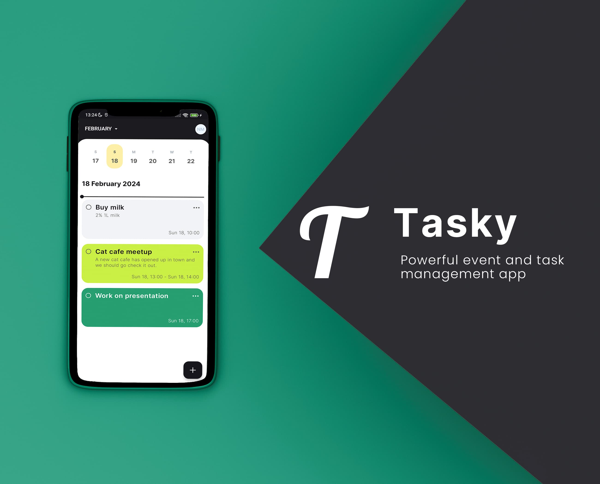

# Tasky

Schedule upcoming tasks and reminders with ease, as well as events, where you can invite multiple people and mark your attendance accordingly!

## Features

- Authorization with login and register flows.
- Agenda screen for each day, listing all reminders, tasks and events, with a time needle to easily see the progress in the day.
- Automatically scheduled reminders before the agenda, with options for 10 minutes before, 30 minutes before, 1 hour before, 6 hours before or 1 day before.
- Create events where you can upload and attach pictures, as well as invite other users and be invited yourself.
- Create tasks that you can mark as done.
- Create reminders that automatically pop a notification to let you stay on top of your day.
- Edit and delete any existing agenda item.

## Architecture

The app follows the official Android app architecture guidance.

## Technologies

- Written completely in Kotlin
- Jetpack Compose for UI
- Hilt for dependency injection
- Room for local database
- Timber for logging
- Retrofit for networking
- Kotlinx Coroutines for real-time data flows
- Kotlinx Serialization for serializing network data and others
- DataStore preferences with encryption for local user information
- WorkManager for local scheduled jobs
- Compose Destinations for navigation, which uses the official Navigation Component under the hood
- Coil for image loading
- Google Secrets Gradle plugin to store the API URL and key
